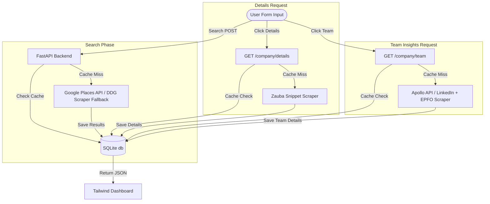

# CompetitorScope - Local Competitor Intelligence Tool

**CompetitorScope** is a self-hosted, lightweight competitor intelligence dashboard that helps founders, market researchers, and business owners discover and analyze local software/IT competitors for specific business domains (e.g., "restaurant", "hospital", "retail") in any Indian city.

The tool fetches real-time data dynamically from public search listings, corporate directories, and team databases, using a cache-first SQLite architecture to ensure lightning-fast subsequent retrievals.

---

## 📸 Product Screenshots & Demo

### 1. Dashboard & Search Results
The application features a sleek dark-themed dashboard styled with Space Grotesk and Inter typography. It includes a responsive search bar, state-based filtering (defaults to Madhya Pradesh), and a dynamic Three.js rotating particle background that pauses when results are rendered to optimize CPU usage.


### 2. Deep Entity Details (Zauba Corp / GST)
Clicking **Company Details** triggers an on-demand scraper that extracts the company's Corporate Identification Number (CIN), GST number, Incorporation Date, active status, and registered address. A visual badge indicates whether the data is a `Fresh` scrape or fetched from the local SQLite `Cached` storage.


### 3. Team Size & Department Breakdown
Clicking **Team Insights** displays aggregate numbers including LinkedIn size ranges, EPFO registered employee counts, and a percentage-based department breakdown (Engineering, Sales, and Marketing) sourced from Apollo.io/DuckDuckGo snippets. 

> [!NOTE]
> CompetitorScope collects aggregate numbers only. It does not harvest individual profiles or PII (Personally Identifiable Information).


---

## 🛠️ Tech Stack & Architecture

### Frontend
- **HTML5 & Vanilla JavaScript**: Smooth event-driven state and accordion handling.
- **Tailwind CSS (CDN)**: Tailored custom design tokens for a premium "intelligence dashboard" aesthetic.
- **Three.js (CDN)**: Interactive 3D particle scene acting as a visual indicator of search state.

### Backend
- **FastAPI (Python)**: High-performance ASGI framework with CORS middleware.
- **SQLAlchemy (SQLite)**: Local persistence layer mapping companies, entity details, and team sizes.
- **BeautifulSoup4 & HTTPX**: Robust scraping engine equipped with realistic User-Agent rotation (Safari/Mac) to cleanly bypass Cloudflare and DDG anti-bot rate limits.

---

## ⚙️ Data Flow & Architecture



---

## 📦 Database Schema

The SQLite database (`companies.db`) is structured into three primary tables:

1. **`companies`**: Holds base search results.
   - `id` (PK), `name`, `website`, `city`, `state`, `business_type`, `linkedin_url`, `created_at`
2. **`company_details`**: Caches entity registration.
   - `company_id` (FK), `cin`, `gst`, `incorporation_date`, `address`, `status`, `fetched_at`
3. **`team_insights`**: Caches organizational numbers.
   - `company_id` (FK), `total_estimate`, `linkedin_range`, `epfo_count`, `dev_count`, `sales_count`, `marketing_count`, `fetched_at`

> [!TIP]
> **Cache Expiry**: Data has a strict **30-day cache policy**. If `fetched_at` is older than 30 days, the backend automatically performs a fresh web scrape to update the cache.

---

## 🚀 Setup & Installation

### Prerequisites
- Python 3.11+
- Virtual Environment (recommended)

### 1. Clone & Initialize Environment
Clone this project to your local directory and create a virtual environment:
```bash
# Navigate to the workspace
cd software_checker

# Create a virtual environment
python -m venv venv

# Activate the virtual environment
# On Linux/macOS:
source venv/bin/activate
# On Windows:
# venv\Scripts\activate
```

### 2. Install Dependencies
```bash
pip install -r requirements.txt
```

### 3. Environment Variable Configuration
Create a `.env` file from the provided template:
```bash
cp .env.template .env
```
Open `.env` in your editor. You can supply your own API keys, or leave them empty to fall back to the built-in scrapers:
```ini
# Google Places API Key (used for search queries)
GOOGLE_PLACES_API_KEY=your_google_places_api_key_here

# Google Custom Search (used for public LinkedIn snippet lookups)
GOOGLE_CUSTOM_SEARCH_API_KEY=your_google_custom_search_api_key_here
GOOGLE_SEARCH_ENGINE_ID=your_custom_search_engine_id_here

# Apollo.io API Key (used for aggregate team department breakdown estimates)
APOLLO_API_KEY=your_apollo_api_key_here
```

---

## 🏃 Running the Application

1. Start the FastAPI backend server:
   ```bash
   uvicorn backend.main:app --reload
   ```
2. Open your browser and navigate to:
   - **`http://localhost:8000`** (FastAPI serves the frontend folder directly)
   - Alternatively, you can use the VS Code Live Server extension on `frontend/index.html` at `http://localhost:5500`.

---

## 🛡️ Best Practices & Design Decisions
- **Robust Scraper Fallback**: If the Google Places API key is missing or hits billing limits, the system dynamically switches to a DuckDuckGo HTML parser using Safari header spoofing to prevent rate blocks.
- **Accurate Corporate Extraction**: Due to Cloudflare protections blocking direct Scraping on Zauba Corp, CIN/GST information is cleanly scraped from Google search engine snippets.
- **CPU Offloading**: The 3D Three.js particle wave scene dynamically pauses rendering as soon as a search executes to prevent frame drops while cards are loading.
